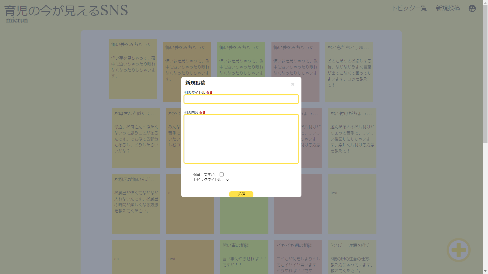
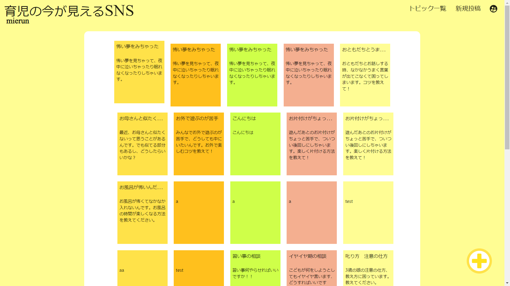
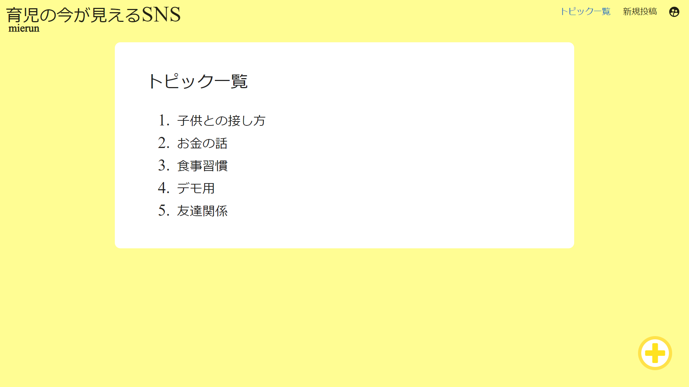

<p align="center">
  
  <samp>
    <b>
      <h1 align="center">
        Mierun
      </h1>
    <br>
      Mierun is the small SNS to reduce burden of childminder.
    </b>
  </samp>
</p>

## Features

- You can post a worries.
- Someone can reply advice to worries.
- Worries are categorized in topic.

## ScreenShots





## How to test

```sh
git clone git@github.com:biprogy-team-b/mierun.git
cd mierun.git
npm install
npm run dev
```

## Contributes

- TEAM: ここで働かせて下さい
  - [Koizumi Naoki](mailto:koizumi@ss.cs.osaka-u.ac.jp)
  - [Shinohara Taisei](mailto:taisei.shinohara1329@gmail.com)
  - [Chiba](mailto:chiba4729@gmail.com)
  - [Nishida Yuta](mailto:ypmtk437.0209@gmail.com)
  - [Yusaku Maeda](mailto:yuni.hutsuka@amanoji-studio.com)
